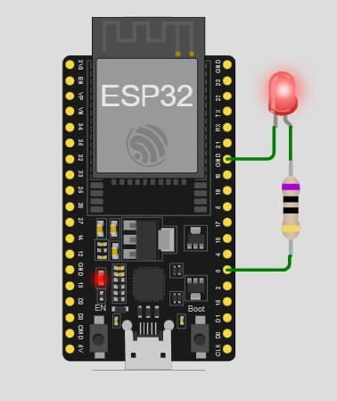

# LED Blink Circuit using ESP32

<hr>

LEDs are small, powerful lights found in many applications. 
Blinking an LED is the "Hello World" of microcontrollers. 
It's as simple as turning a light switch on and off. 
Establishing this fundamental skill will provide a solid foundation for more complex experiments.

## Components Required:

- 1 x ESP32 Board
- 1 x Led (any color)
- 1 x Resistor (100 ohms)
  
<br>
<hr>

## Diagram



<hr>

## ***ESP32 Code***

```cpp

const int LedPin = 0;

void setup() {
  // put your setup code here, to run once:
  pinMode (LedPin, OUTPUT);
}

void loop() {
  // put your main code here, to run repeatedly:
  digitalWrite(LedPin, HIGH);
  delay(1000);
  digitalWrite(LedPin, LOW);
  delay(1000);
}

```