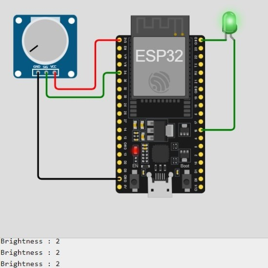

# LED_brightness_control

<hr>

<div align ="justify">

Controlling the brightness of an LED with a potentiometer is an essential microcontroller project that teaches analog input handling. 
By varying the resistance of the potentiometer, you can adjust the voltage and thus control the LED's brightness. 
This project demonstrates the use of analog-to-digital conversion (ADC) to read the potentiometer's position and pulse-width modulation (PWM) to adjust the LED's brightness. Understanding these concepts is crucial for projects involving variable input and output controls in embedded systems.

</div>

## Components Required:
- 1 x ESP32 Board
- 1 x Led (any color)
- 1 x Potentiometer
  
<br>
<hr>

## Diagram


<hr>

## ***ESP32 Code***

```cpp

const int potPin = 34;
const int LedPin = 16;
int Brightness = 0;

void setup() {
  // put your setup code here, to run once:
  pinMode (LedPin, OUTPUT);
  Serial.begin(115200);
  delay(1000);
}

void loop() {
  // put your main code here, to run repeatedly:
  Brightness = analogRead(potPin);
  analogWrite(LedPin, Brightness);
  Serial.print("Brightness: ");
  Serial.println(map(Brightness, 0, 4095, 0, 100));
  delay(500);
}

```