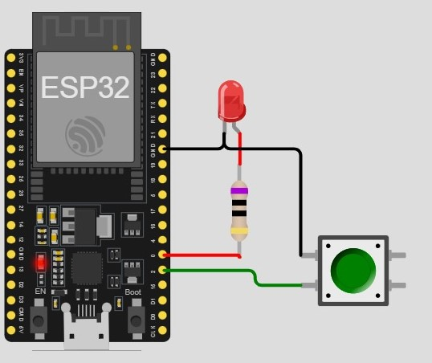

# LED Control using switch

<hr>
<div align ="justify">

Controlling an LED with a switch is a fundamental microcontroller project. 
By using a simple push-button switch, you can directly control the state of an LED, turning it on and off based on the switch's position. 
This project introduces the basics of digital input and output, 
providing a hands-on understanding of how microcontrollers interact with external components. 

</div>

## Components Required:
- 1 x ESP32 Board
- 1 x Led (any color)
- 1 x Resistor (100 ohms)
- 1 x switch
  
<br>
<hr>

## Diagram


<hr>

## ***ESP32 Code***

```cpp

const int LedPin = 0;
const int Button = 2 ;

void setup() {
  // put your setup code here, to run once
  pinMode(LedPin, OUTPUT);
  pinMode(Button, INPUT_PULLUP);
}

void loop() {
  // put your main code here, to run repeatedly
  if (digitalRead(Button) == 0) {
    digitalWrite(LedPin, LOW);
  } else {
    digitalWrite(LedPin, HIGH);
  }
}

```
