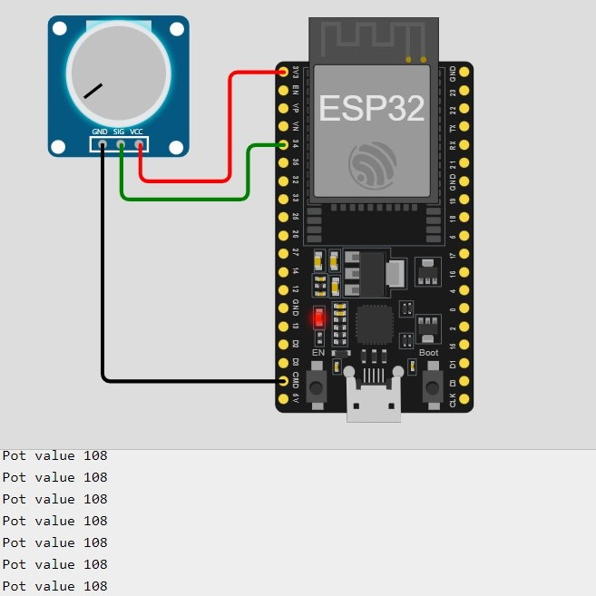

# Using a Potentiometer

<hr>
<div align ="justify">
Reading the value of a potentiometer using a microcontroller is a fundamental project that introduces analog input processing. 
A potentiometer acts as a variable resistor, and by turning its knob, you can change the resistance, which in turn affects the voltage output. 
This project involves connecting the potentiometer to an analog input pin on the microcontroller and reading its value using analog-to-digital conversion (ADC). 
Understanding how to read and interpret analog values is crucial for projects involving variable sensor inputs and user controls.

</div>

## Components Required:
- 1 x ESP32 Board
- 1 x Potentiometer
  
<hr>

## Diagram & ESP32 Code



```cpp

const int potPin = 34;
int potValue = 0;

void setup() {
  // put your setup code here, to run once:
  Serial.begin(115200);
  delay(1000);
}

void loop() {
  // put your main code here, to run repeatedly:
  potValue = analogRead(potPin);
  Serial.print("Pot value ");
  Serial.println(potValue);
  delay(500);
}

```