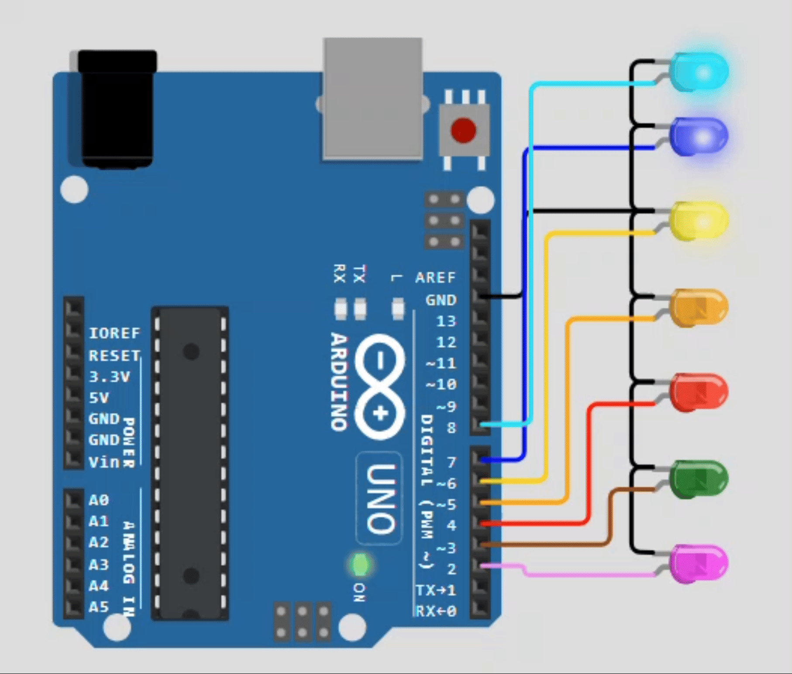

# Using For Loop

A for loop is a control flow statement for specifying iteration, which allows code to be executed repeatedly. 
It is particularly useful when the number of iterations is known before entering the loop.

The loop consists of three main components: `initialization`, `condition`, and `increment/decrement`.

- **Initialization:** Sets the starting point.
- **Condition:** Defines the loop's end condition.
- **Increment/Decrement:** Modifies the loop variable each iteration.
----
```cpp

//syntax
for (initialization; condition; increment/decrement) {
  // Code to execute
}

/*----------------------------------------------------------------------------------------------------------*/

//Example:

for (int i = 2; // Initialization: int i is set to 0
                i <= 8; // Condition: loop continues while i is less than or equal to 8
                        i++) // Increment: increases i by 1 after each iteration
{ 
  // Code to execute
  pinMode(i, OUTPUT); // Set pins 2 to 8 as outputs
}
```

- Initialization: `int i = 2` sets i to 2.
- Condition: `i <= 8` runs the loop while i is less than or equal to 8.
- Increment: `i++` increases i by 1 each time the loop runs.

----

## Components Required:

- 1 x Arduino Uno
- 7 x Leds (any color) 
  
----

## **Diagram**



## ***Arduino Code***

```cpp

void setup() {
  // put your setup code here, to run once:
  for(int i = 2; i<=8;i++){
    pinMode(i, OUTPUT);
  }
}

void loop() {
  // put your main code here, to run repeatedly:
  for(int i = 2; i<9;i++){
    digitalWrite(i-1, LOW);
    digitalWrite(i, HIGH);
    delay(60);
  }
  for(int i = 8; i>=2;i--){
    digitalWrite(i, HIGH);
    digitalWrite(i+1, LOW);
    delay(60);
  }
}

```