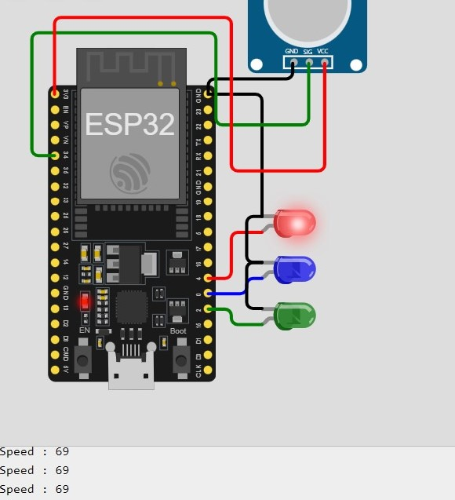

# Using If-Else Statements for LED Control

<hr>

This project demonstrates the use of if-else statements to control three LEDs based on the value read from a sensor (potentiometer in this case). 
The sensor-value is mapped to a speed range, and the LEDs are turned on or off depending on the speed. 
This project helps understand how to make decisions in code based on input conditions, allowing for dynamic and responsive behavior in embedded systems.


## Components Required:

- 1 x ESP32 Board
- 1 x Led (RED)
- 1 x Led (GREEN)
- 1 x Led (BLUE)
- 1 x Potentiometer
  
<br>
<hr>

## Diagram



<hr>

## ***ESP32 Code***

```cpp

const int LedG = 2;
const int LedB = 0;
const int LedR = 4;
const int Sensor = 34;

int SensorVal = 0;
int Speed;

void setup() {
  // put your setup code here, to run once:
  pinMode(LedR, OUTPUT);
  pinMode(LedG, OUTPUT);
  pinMode(LedB, OUTPUT);
  Serial.begin(115200);
}

void loop() {
  // put your main code here, to run repeatedly:
  SensorVal = analogRead(Sensor);
  Speed = map (SensorVal, 0, 4095, 0, 100);
  if (Speed > 0 && Speed <= 30) {
    digitalWrite(LedG, HIGH);
    digitalWrite(LedR, LOW);
    digitalWrite(LedB, LOW);
  } 
  else if (Speed > 30 && Speed <= 60) {
    digitalWrite(LedB, HIGH);
    digitalWrite(LedG, LOW);
    digitalWrite(LedR, LOW);
  } 
  else if (Speed > 60 && Speed <= 100) {
    digitalWrite(LedR, HIGH);
    digitalWrite(LedG, LOW);
    digitalWrite(LedB, LOW);
  }
  Serial.printf("Speed %d\n", Speed);
}

```