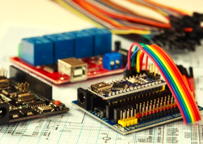
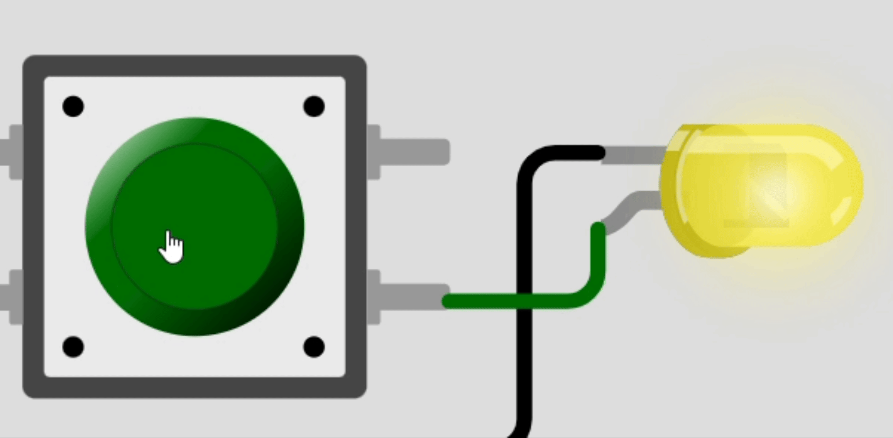
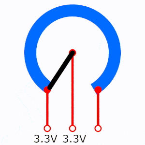
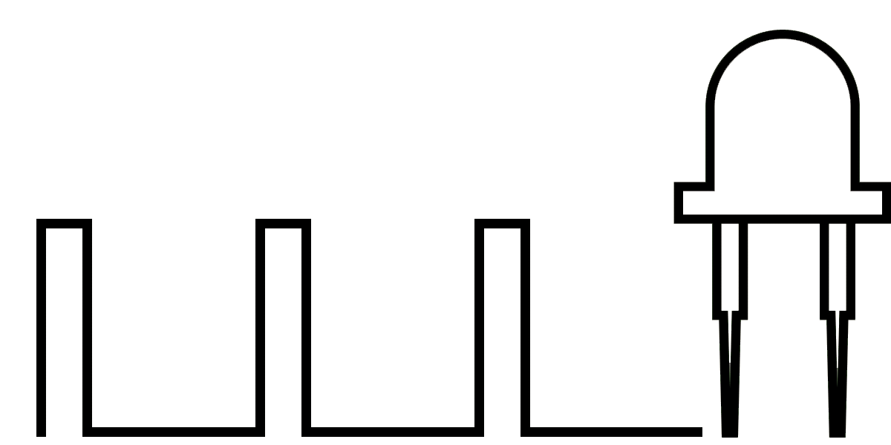

# Microcontroller Projects Journey     

***Welcome to my Microcontroller Projects Journey repository!***

----

 
  
This repository showcases a series of projects that 
demonstrate my journey from basic to advanced microcontroller applications. 
Each project is designed to highlight specific skills and concepts in 
electronics and embedded systems, using a hands-on approach. 

----

 

## Getting Started

1. **Read the [Pre-requisites](#Pre-requisites)**: Familiarize yourself with the basic requirements and tools needed.
2. **Follow the Basic Tutorials**: Understand fundamental concepts and coding practices.
3. **Try the Projects**: Apply what you've learned by building simple projects.

----

# Pre-requisites

## Hardware

- A microcontroller board (e.g., Arduino Uno, Esp32)
- USB cable for programming the board
- Breadboard
- Jumper wires
- Basic electronic components (LEDs, resistors, sensors)

## Software

- Arduino IDE : <a href="https://www.arduino.cc/en/software"> Download </a>

## Basic Knowledge

- Basic understanding of electronics
- Familiarity with programming concepts (variables, loops, conditions)

## Setting Up

1. **Install Arduino IDE**: Follow the instructions on the Arduino website.
2. **Connect the Board**: Use the USB cable to connect your microcontroller to your computer.
3. **Open Arduino IDE**: Launch the software and select your board and port under the `Tools` menu.
4. **Upload a Sketch**: Try uploading the "Blink" example sketch to ensure everything is set up correctly.

You are now ready to start learning and building with microcontrollers!

----

 

### ***Project Links***

|***No.***|***Name***|*|
|:---:|:----|:---:|
|1. |[LED_Blink](./Basic/LED_Blink/LED_Blink.md)||
|2. |[LED_control_using_switch](./Basic/LED_control_using_switch/LED_control_using_switch.md)||
|3. |[Using_a_Potentiometer](./Basic/Using_a_Potentiometer/Using_a_Potentiometer.md)||
|4. |[LED_brightness_control](./Basic/LED_brightness_control/LED_brightness_control.md)||
|5. |[If-else_statements](./Intermediate/If-else_statements/If-else_statements.md)||
|6. |[For_loop](./Intermediate/For_loop/For_loop.md)||
|7. |[While_loop](./Intermediate/While_loop/While_loop.md)||

-----
