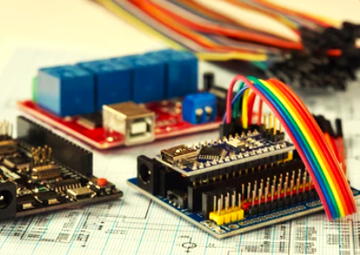

# Microcontroller Projects Journey

*Welcome to my Microcontroller Projects Journey repository!*

This repository showcases a series of projects that demonstrate my journey from basic to advanced microcontroller applications. 
Each project is designed to highlight specific skills and concepts in electronics and embedded systems, using a hands-on approach.

## Projects

    

        <table>
            <thead>
                <tr>
                    <th>Sr.No.</th>
                    <th>Project Links</th>
                </tr>
            </thead>
            <tbody>
                <tr>
                    <td>1.</td>
                    <td><a href="./Basic/LED_Blink/LED_Blink.md">LED_Blink</a></td>
                </tr>
                <tr>
                    <td>2.</td>
                    <td><a href="./Basic/LED_control_using_switch/LED_control_using_switch.md">LED_control_using_switch</a></td>
                </tr>
                <tr>
                    <td>3.</td>
                    <td><a href="./Basic/Using_a_Potentiometer/Using_a_Potentiometer.md">Using_a_Potentiometer</a></td>
                </tr>
                <tr>
                    <td>4.</td>
                    <td><a href="./Basic/LED_brightness_control/LED_brightness_control.md">LED_brightness_control</a></td>
                </tr>
                <tr>
                    <td>5.</td>
                    <td><a href="./Intermediate/If-else_statements/If-else_statements.md">If-else_statements</a></td>
                </tr>
                <tr>
                    <td>6.</td>
                    <td><a href="./Intermediate/For_loop/For_loop.md">For_loop</a></td>
                </tr>
                <tr>
                    <td>7.</td>
                    <td><a href="./Intermediate/While_loop/While_loop.md">While_loop</a></td>
                </tr>
            </tbody>
        </table>
    

    

        
    

### End
